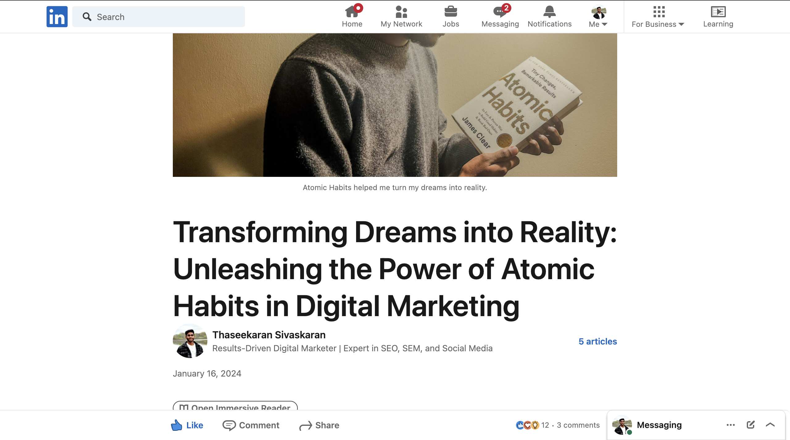
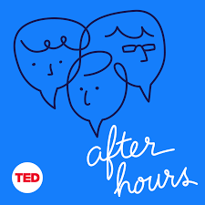
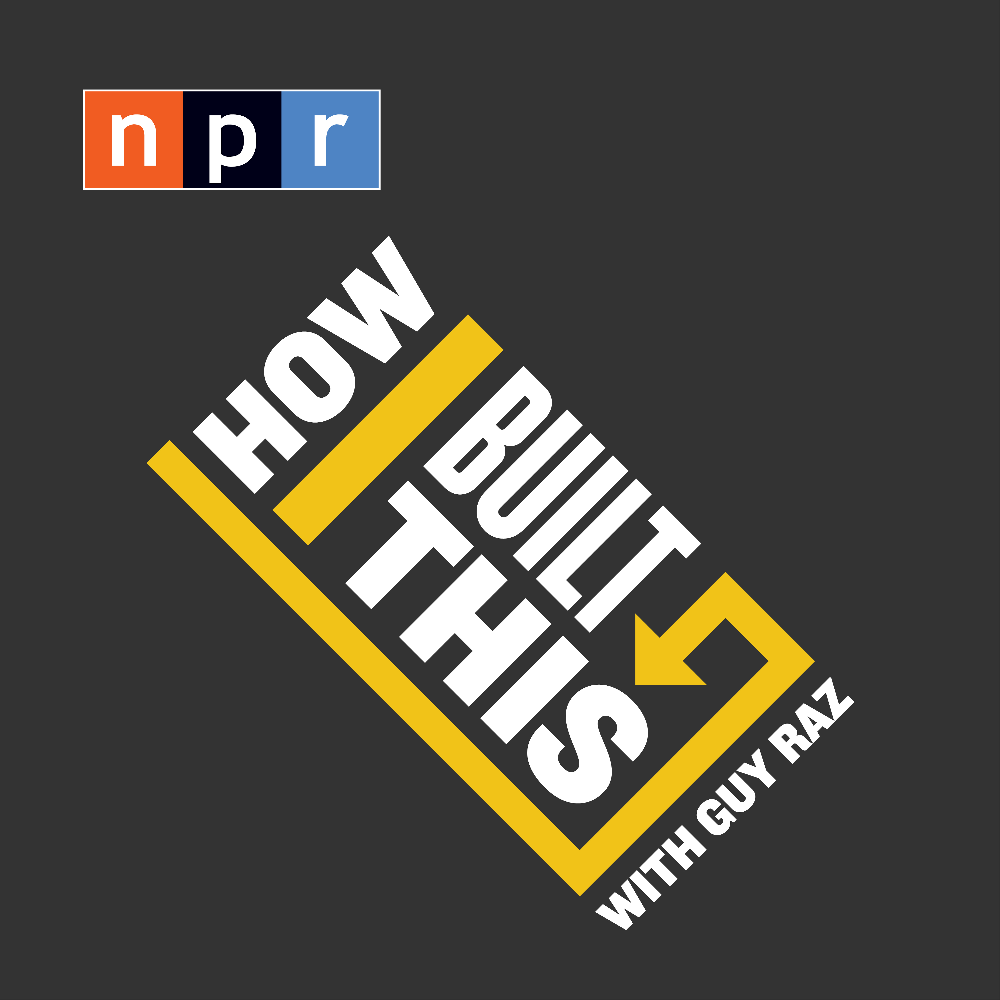
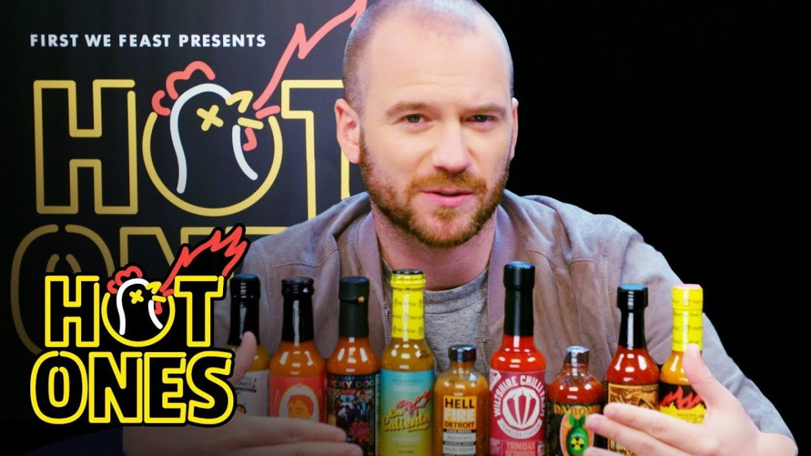

dev.ts.readme-file
# Thaseekaran & Yi Ting Elaine

This is a repo for the assignment.

## Thaseekaran

_Background_

Meet Thaseekaran from Sri Lanka, where the spices are hot, and so is his love for coding – it's practically his soulmate! As a South Asian wizard of web development, he decided to spice things up in Canada by creating a Tamil date website. When asked about his secret ingredient, he simply grinned and said, "It's all in the code, baby – just like a good curry, but in English!"

_Hobbies_

1. Reading Books (Business,Productivity,Selfhelp)

Atomic Habits

2. Writing Articles about Productivity

## Yi Ting Lai (Elaine) 

**Background**

This is me, from Hong Kong, an Asian who finds joy in cooking and appreciating Asian cuisine especially Fried Rice. I take pride in providing constructive feedback on others' attempts at cooking Asian food.

**Hobbies**

1. Listening to Podcast (especially business stories) 

[Click here to listen](https://podcasts.google.com/search/after%20hours) 

[Click here to listen](https://podcasts.google.com/feed/aHR0cHM6Ly9mZWVkcy5ucHIub3JnLzUxMDMxMy9wb2RjYXN0LnhtbA)

2. Watching Food videos and chanllenges  - *For example Hot Ones from First we feast* 

**Favourtie Movies**

*I am a hopeless romantic in movies*
1. Crazy Stupid Love
2. La La Land 

Special Talents and skills:
- Love martial arts
    *For example Taekwondo, Muay Thai,*
- Eating Spicy 

My favourite website: 
- [Pinterest](https://www.pinterest.com/)
- [Youtube](https://www.youtube.com/)

